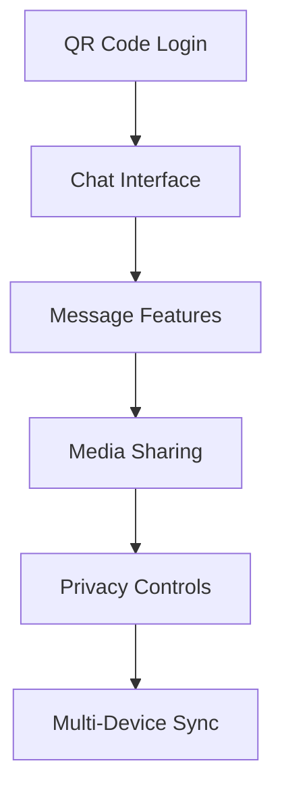
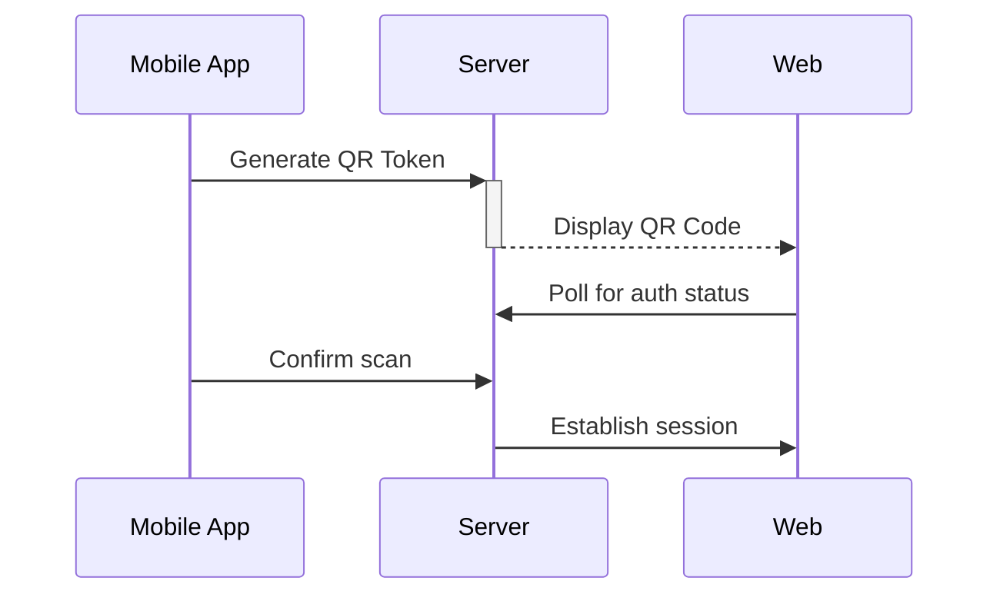

# BlinkPass - Secure Messaging Reimagined 💬🔒


## 🌟 Complete WhatsApp Web Experience Plus More

BlinkPass delivers **100% of WhatsApp Web's core functionality** with premium enhancements:



## 🔍 Every WhatsApp Web Feature Implemented

### 🔑 Authentication
- **QR Code Scanning** 📷 - Scan with mobile app
- **Biometric Login** 👆 - Fingerprint/FaceID unlock
- **2-Step Verification** 🔒 - Extra security layer
- **Session Management** 📱 - View active devices

### 💬 Core Messaging
- **Real-time Chat Sync** ⚡
- **Message Status** (✓✓, Read Receipts)
- **Reply/Forward/Star** messages
- **Group Chats** 👥 with admin controls
- **Typing Indicators** ✍️
- **Online Status** 🟢

### 🖼️ Media Features
- **Image/Video Sharing** 🏞️🎬
- **Document Sharing** 📎 (PDF, Word, etc.)
- **Voice Messages** 🎤 with playback controls
- **Stickers & GIFs** 😺🎭
- **Contact Cards** 📇

### ⚙️ WhatsApp Web UI Elements
- **Sidebar Chat List** ↔️
- **Chat Header** with profile/group info
- **Message Bubble** styles
- **Emoji Picker** 😀
- **Search Bar** 🔍
- **Dark/Light Mode** 🌙☀️

## 🆙 Enhanced Features

| WhatsApp Standard | BlinkPass Plus |
|------------------|---------------|
| Basic Encryption | Military-Grade E2EE |
| 100MB File Limit | 2GB File Sharing |
| No Message Recall | 60-min Recall Window |
| Basic Themes | Full UI Customization |
| No Scheduled Msgs | Smart Scheduling |

## 🖥️ Screenshots Gallery 🖼️

<div align="center">

|  |  |
|:-----------------------------------------------------:|:----------------------------------------------------------------:|
| *Modern Landing Page*                                 | *Competitive Advantages*                                        |

|  |  |
|:--------------------------------------------------------------:|:-----------------------------------:|
| *Customer Validation*                                          | *Knowledge Base*                   |

|  |  |
|:----------------------------------------------------:|:----------------------------------------------:|
| *Quick Onboarding*                                   | *Secure Access*                               |

|  |  |
|:---------------------------------------:|:--------------------------------------------------------:|
| *Control Center*                        | *Connected Devices*                                     |

|  |
|:-------------------------------------------------------------------------------------------------:|
| *Chat Window*                                                          |

</div>


## 🛠️ Technical Implementation

### QR Auth Flow


### Real-time Architecture
- **WebSocket** for instant messaging
- **Service Worker** for offline support
- **IndexedDB** for local cache
- **Push API** for notifications

### Security Stack
- **Signal Protocol** for E2EE
- **Web Cryptography API**
- **Secure QR Handshake**
- **Device Attestation**

## 🚀 Getting Started

```bash
# Clone with all dependencies
git clone --depth=1 https://github.com/shubham001official/blinkpass.git
cd blinkpass

# Install & run
npm install
npm run dev
```

**Environment Variables Needed:**
```
NEXT_PUBLIC_WS_URL=wss://your-websocket
AUTH_SECRET=your-secure-key
DATABASE_URL=postgres://...
```

## 🌐 Deployment

[](https://vercel.com/new/git/external?repository-url=https://github.com/shubham001official/BlinkPass)

**Or manual deploy:**
```bash
vercel --prod --confirm
```

<p align="center">
🔐 <strong>All WhatsApp Web Features</strong> + <strong>Premium Enhancements</strong> 🔍
</p>

<details>
<summary>📜 Full Feature Checklist</summary>

### 100% WhatsApp Web Parity
- [x] QR Code Login
- [x] Message Status Indicators
- [x] Media Gallery View
- [x] Contact Search
- [x] Notification Settings
- [x] Group Creation Flow
- [x] Profile Editing
- [x] Chat Archiving

### Exclusive Enhancements
- [x] Encrypted Cloud Backup
- [x] Message Scheduling
- [x] Custom Themes
- [x] Advanced Search Filters
- [x] Chat Folders
</details>


## 📈 Why Choose BlinkPass?

| Feature        | BlinkPass 🔥 | Traditional Auth 🔐 |
|---------------|------------|-------------------|
| Security      | Passwordless (WebAuthn) | Password-based |
| User Experience | One-tap login | Manual entry |
| Recovery      | Multi-device sync | Email/SMS OTP |
| Compliance    | FIDO2 Certified | Varies |
| Cost          | Lower TCO | Higher support costs |

## 🤝 Contributing
We welcome contributions! Please read our [Contribution Guidelines](CONTRIBUTING.md) before submitting pull requests.

## 📜 License
BlinkPass is [MIT licensed](LICENSE).

## 📬 Contact
- **Email**: [security@blinkpass.com](mailto:shubham001official@gmail.com)
- **Twitter**: [@BlinkPassApp](https://twitter.com/S_Shubham001)
- **Security Issues**: [security@blinkpass.com](mailto:shubham001official@gmail.com)

---

**📬 Contact:** dev@blinkpass.app | **📜 License:** AGPL-3.0  
**⚠️ Disclaimer:** Independent project not affiliated with WhatsApp/Meta

---

<p align="center">
  Made with ❤️ by the BlinkPass Team | Securing the digital world, one blink at a time
</p>
